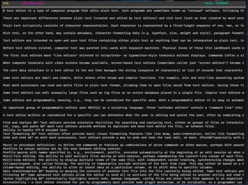

# Dim

Dim is a simple terminal-based text editor inspired by Vim. Its aim is to provide an easier and less functional alternative to learning Vim.



# Installation

You must have Python 3.8 or higher to run Dim.

## Install via Pip

To install using pip, run the following command.

```bash
pip install dim-editor
```

Then, you can launch the editor with
```bash
dim
python -m dim
```

## Building Manually

To build Dim manually, clone or download this repository and navigate into the main folder.

On Windows, you must run this command to install curses.

```bash
pip install -r win-requirements.txt
```

You can run the editor with

```bash
python dim/dim.py
```

There are tools available to compile the Python application into an executable format. If you decide to use one of these tools, make sure that dim/debug and dim/tutorial are included as subdirectories.